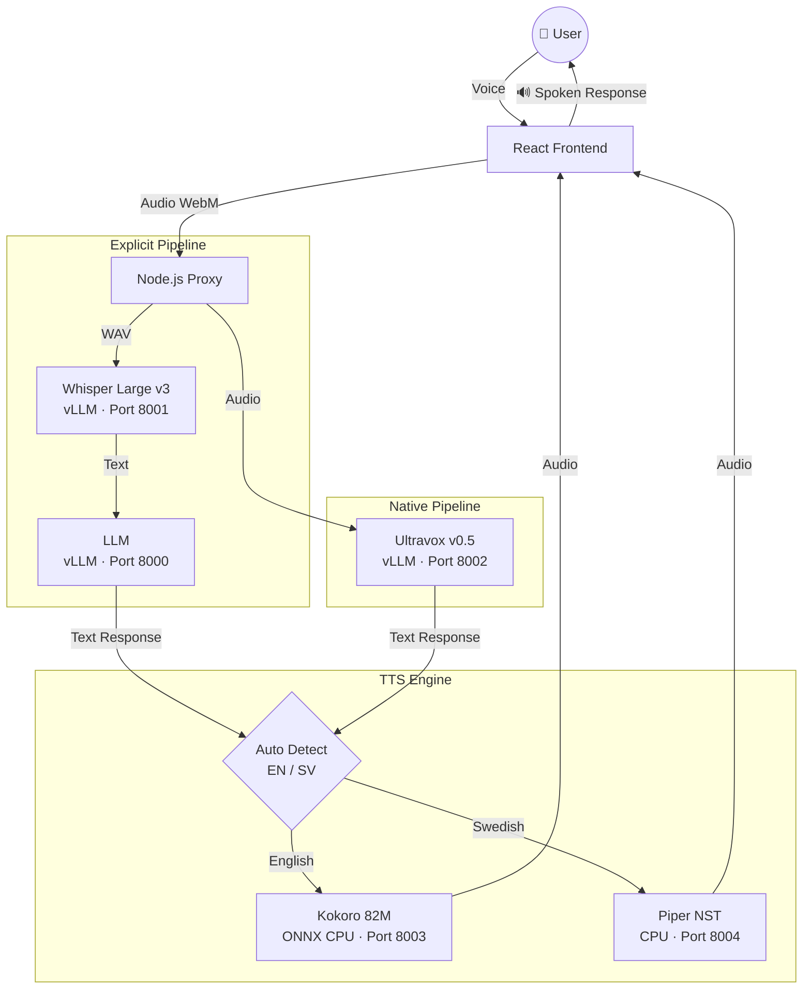

# Autoversio Intelligence Node

<div align="center">

🔒 **100% Local & Private** · 🎙️ **STT → LLM → TTS** · 🧠 **Native Multimodal** · 🇸🇪🇬🇧 **Multilingual**

---

*One of the most complete open-source, self-hosted voice AI stacks available.*  
*Your data never leaves your server. Not a single byte.*

[](https://opensource.org/licenses/MIT)
[](https://react.dev)
[](https://www.typescriptlang.org)
[](https://www.docker.com)
[](https://docs.vllm.ai)

---

</div>

## What is this?

**Autoversio Intelligence Node** is a complete, self-hosted voice AI powerhouse. It bundles best-in-class open-source models into a single deployable stack — giving you the power of a modern voice assistant with full data sovereignty and zero cloud dependencies.

> **Speak → Think → Speak back.** All on your own hardware.

---

## 🏗 The Full Stack

| Layer | Technology | Role |
|---|---|---|
| **STT** | [Whisper Large v3](https://huggingface.co/openai/whisper-large-v3) via vLLM | Speech → Text |
| **LLM** | Any OpenAI-compatible model (Qwen, Llama, etc.) via vLLM | Reasoning & Response |
| **Native Audio LLM** | [Ultravox v0.5](https://huggingface.co/fixie-ai/ultravox-v0_5-llama-3_1-8b) via vLLM | Audio → Text (no STT bottleneck) |
| **TTS (EN)** | [Kokoro-82M](https://github.com/remsky/kokoro-fastapi) (ONNX CPU) | Text → Natural English Speech |
| **TTS (SV)** | [Piper](https://github.com/rhasspy/piper) (`sv_SE-nst-medium`) | Text → Native Swedish Speech |
| **Frontend** | React 18 + TypeScript + Vite | Premium dark UI |
| **Backend** | Node.js + Express | API Proxy & Audio processing |

---

## 🎯 Two Voice Interaction Modes

### 🗣️ STT Agent (Explicit Pipeline)
The classic voice pipeline — maximum compatibility and control.
```
Voice → Whisper (STT) → LLM → Kokoro/Piper (TTS) → Audio
```
- Hold `SPACE` or click the mic to record
- Whisper transcribes → LLM reasons → TTS speaks back
- Personality modes: Standard, Sycophant, Formal, Rude
- Voice output with **auto language detection** (EN → Kokoro, SV → Piper)

### 🧠 Native Agent (Multimodal Pipeline)
Zero transcription overhead — audio goes directly to Ultravox.
```
Voice → Ultravox (Audio LLM) → Kokoro/Piper (TTS) → Audio
```
- Audio is processed natively as weights — no STT step
- Lower latency, better prosody understanding
- Same voice output controls as STT Agent

---

## 🔊 Multilingual TTS

The system automatically selects the right voice engine per response:

| Language | Engine | Voice | Quality |
|---|---|---|---|
| 🇬🇧 English | **Kokoro** (82M ONNX) | `af_heart` | ⭐⭐⭐⭐⭐ Natural, expressive |
| 🇸🇪 Swedish | **Piper** | `sv_SE-nst-medium` | ⭐⭐⭐⭐ Native accent |

Toggle: **Auto** (detects `å/ä/ö` and Swedish words) · **🇬🇧** · **🇸🇪**

---

## 🛠 Features

- **Full Voice Loop**: Talk → get a spoken response, no typing required
- **Privacy by Design**: Zero telemetry, zero cloud. Self-hosted everything.
- **GDPR Ready**: Data never leaves your infrastructure
- **Sleek Dark UI**: Grok-inspired premium interface  
- **Personality System**: Customize agent tone per conversation
- **Real-time Transcription**: Live transcribe mode for long-form audio
- **WebSocket Stream**: Lowest-latency transcription pipeline
- **Health Dashboard**: Live status of all services + Compliance view
- **Auto Language Detection**: TTS engine auto-selected from response content

---

## 🚀 Getting Started

### Prerequisites
- Docker & Docker Compose
- NVIDIA GPU (recommended for Whisper + Ultravox)
- Node.js 20+ (local development)

### Deploy with EasyPanel / Docker Compose

**Full AI stack** (Whisper + Ultravox + Kokoro + Piper):
```bash
docker-compose -f docker-compose.vllm.yml up -d
```

**App only** (connects to existing AI services):
```bash
docker-compose up -d
```

---

## ⚙️ Environment Variables

| Variable | Description | Default |
|---|---|---|
| `PORT` | Web server port | `3000` |
| `WHISPER_URL` | Whisper vLLM endpoint | `http://whisper-vllm:8001` |
| `ULTRAVOX_URL` | Ultravox vLLM endpoint | `http://ultravox-vllm:8002` |
| `KOKORO_URL` | Kokoro TTS endpoint | `http://kokoro-tts:8003` |
| `PIPER_URL` | Piper TTS endpoint | `http://piper-tts:8004` |
| `ULTRAVOX_MODEL_NAME` | Ultravox model ID | `ultravox` |
| `VITE_CHAT_API_URL` | LLM API (OpenAI-compatible) | `http://172.17.0.1:8000/v1` |
| `VITE_CHAT_MODEL_NAME` | LLM model name | `autoversio` |

---

## 📐 Architecture



---

## 🛡 Privacy & Compliance

- **No external API calls** made by the application itself
- **No tracking, analytics, or telemetry** of any kind
- **Audio processed in-memory** and deleted immediately after transcription
- **Self-hosted models** — weights run on your hardware, your network
- Suitable for **GDPR**, **HIPAA**, and **NIS2** compliance contexts

---

## 📦 Services Overview

| Service | Image | Port | GPU |
|---|---|---|---|
| `app` | `Dockerfile.app` | 3000 | ❌ |
| `whisper-vllm` | `Dockerfile.whisper-vllm` | 8001 | ✅ |
| `ultravox-vllm` | `vllm/vllm-openai` | 8002 | ✅ |
| `kokoro-tts` | `ghcr.io/remsky/kokoro-fastapi-cpu` | 8003 | ❌ CPU |
| `piper-tts` | `Dockerfile.piper` | 8004 | ❌ CPU |

---

## About Autoversio

**[Autoversio](https://www.autoversio.ai)** is a Swedish AI provider offering flexible deployment options:
- **Semi-Local**: Cloud-hosted in Sweden for compliance and performance
- **Fully On-Prem**: Complete data sovereignty with dedicated hardware

---

<p align="center">
  <strong>© 2025 Magnus Froste · Built with ❤️ for the open-source community</strong><br>
  <a href="https://www.autoversio.ai">autoversio.ai</a> · <a href="https://opensource.org/licenses/MIT">MIT License</a>
</p>
